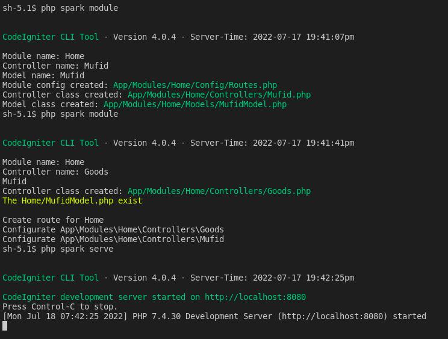
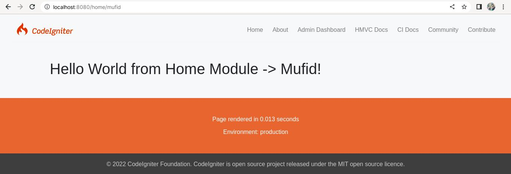
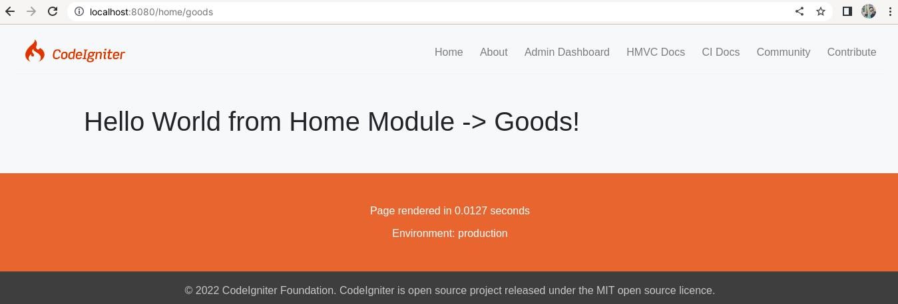

# Codeigniter4-HMVC

[](https://circleci.com/gh/MufidJamaluddin/Codeigniter4-HMVC)

This is Hierarchical model–view–controller (HMVC) project starter using CodeIgniter4 framework. By HMVC architecture, I hope we could make scalable web application. 

## Prerequisites

1. PHP 7.2 or above
2. Composer version 1.10 or above
3. intl PHP extension (for formatting currency, number and date/time, see [CodeIgniter4 Docs](https://codeigniter4.github.io/userguide/intro/requirements.html) )
4. xdebug PHP extension (for testing purpose only, optional)
5. php_sqlite3 PHP extension (for testing purpose only, very optional)

## How to use

1. Run ```composer create-project mufidjamaluddin/codeigniter4-hmvc your_project```, to create your project based on this boilerplate.
2. Configure the app by change the ```env``` file.
3. Run ```php spark serve``` for run the app.

## Make new module

### Tutorial

1. Update the spark files

```bash
composer update
cp vendor/codeigniter4/framework/public/index.php public/index.php
cp vendor/codeigniter4/framework/spark .
```

2. Call the ```php spark module``` command, then input a module, controller, and model name (Automatically configure a routes modules).

3. Run ```composer test``` for run your test cases (optional, see [CodeIgniter4 Docs](https://codeigniter4.github.io/userguide/testing/index.html) or [PHPUnit Docs](https://phpunit.readthedocs.io/en/9.1/) )

4. Run in the browser by ```php spark serve``` command

### Screenshot Example







<br/>

## Notes

Always run ```php spark route:update``` after create or change module, controller, or controller methods directly without `php spark module` command except if you want to configure module route manually.

## Command Prompt

### Command module

The easiest way to create a controller (required) and a model inside a module. Create a module or a model if it doesn't exist.

Usage: Call the ```php spark module``` command, then input a module, controller, and model name.


### Command route:update parameter

Parameters:
    '-n' = Set module namespace (default App\Modules)
    '-i' = Set route with /index path without parameter (true/false, default true)
    '-m' = Set route one module name to be create/update (app/Modules/YourModuleName)
    '-f' = Set module folder inside app path (default Modules)


Usage command ```php spark route:update -i false -m YourModule```

### Command module:create parameter

Example ```php spark module:create invoice```

First parameter (invoice) is your new module.


### PHPUnit

You can run all of your test cases by run ```composer test```

### Other Command

You can get all command prompt list by run ```php spark list``` and composer command in composer.json > scripts.

## HMVC Structure

### Default Structure

By default, there is the structure of Codeigniter4-HMVC.

```
app
   \Modules
       \{YourModule}
            \Config
                Routes.php
            \Controllers
                BaseController.php
                {YourController}.php
            \Models
                {YourModel}.php
    \Views
        \template
            {YourTemplate}.php
        \{your view module folder}
            {Your View}.php
    ...
    
    \tests
        \unit
            ...
        \integration
            \Modules
                \{YourModule}
                    {YourController}.php
        ...
```

### Custom Structure

You can structuring your module freely, because CodeIgniter4 use PSR4. 
If you want to change the structure of Routes.php in Config Module folder or the structure of Module Controllers, you must change app/Config/Routes.php in HMVC Routing section and modify RouteUpdate.php in app/Commands folder.

## Contribute

You can contribute for extend CodeIgniter4 capabilities or add command prompt for development use by fork this repository. After that, you can make pull request.
